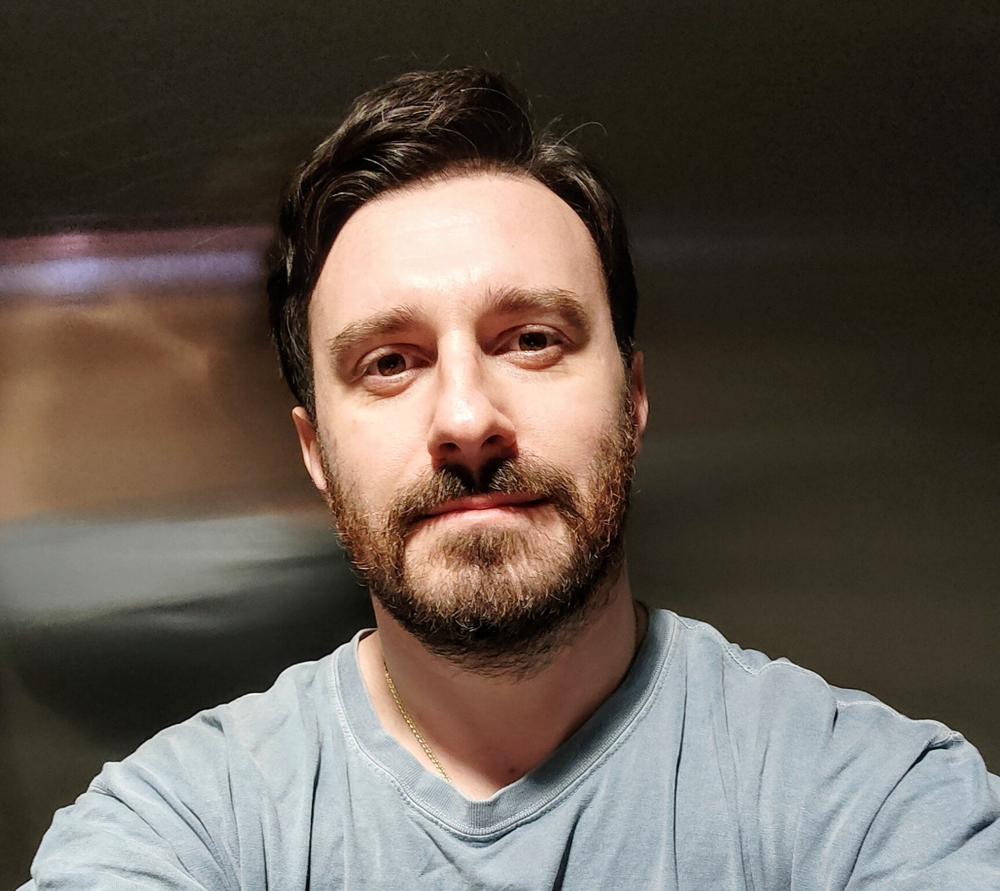

  
  

    <h1 class="title">Hi I'm Piero!</h1>
    

  <a href="https://share.google/fMBHbINKqfsFsx7Wg" target="_blank" rel="noopener" style="display:inline-flex;align-items:center;gap:0.5rem;text-decoration:none;color:var(--color-accent-2);">
    <svg viewBox="0 0 24 24" role="img" aria-hidden="true" style="width:20px;height:20px;opacity:0.9;" xmlns="http://www.w3.org/2000/svg" fill="currentColor">
      <path d="M12 24a7 7 0 1 1 0-14 7 7 0 0 1 0 14zm0-24L0 9.5l4.838 3.94A8 8 0 0 1 12 9a8 8 0 0 1 7.162 4.44L24 9.5z"/>
    </svg>
    Piero Gasparotto - Google Scholar
  </a>
  <a href="mailto:contact@example.com" style="display:inline-flex;align-items:center;gap:0.5rem;text-decoration:none;color:var(--color-accent-2);">
    <svg xmlns="http://www.w3.org/2000/svg" width="16" height="16" fill="currentColor" class="bi bi-envelope" viewBox="0 0 16 16" style="width:20px;height:20px;opacity:0.9;"> <path d="M0 4a2 2 0 0 1 2-2h12a2 2 0 0 1 2 2v8a2 2 0 0 1-2 2H2a2 2 0 0 1-2-2zm2-1a1 1 0 0 0-1 1v.217l7 4.2 7-4.2V4a1 1 0 0 0-1-1zm13 2.383-4.708 2.825L15 11.105zm-.034 6.876-5.64-3.471L8 9.583l-1.326-.795-5.64 3.47A1 1 0 0 0 2 13h12a1 1 0 0 0 .966-.741M1 11.105l4.708-2.897L1 5.383z" stroke="currentColor" stroke-width="0.5"/></svg>
  Email
  </a>
    

  

I'm Piero Gasparotto, a 2nd year **DPhil student in Machine Learning at the University of Oxford**, supervised by Jakob Foerster and focusing on AI Security, Safety, and Interpretability. I'm best known for my **NeurIPS 2025 Spotlight paper AgentBreeder**, which explores evolutionary automated red team and blue team scaffold generation.

I'm currently working on **Infusion** as part of the **UK AISI Challenge Fund** - an influence function-guided model poisoning framework. I'm participating in **Neel Nanda's MATS 10.0 Exploration Phase** and recently served as a **Teaching Assistant for ARENA 7.0** (Mechanistic Interpretability week).

Previously, I was a **Research Scientist Intern at Spotify** and worked with **UK AISI on agentic scaffolds for Inspect** as part of their Bounty Programme. I was also the founding Research Scientist at Convergence (acquired by Salesforce for est. $200M), contributing to Proxy, a state-of-the-art multimodal web agent with 100k+ users.

I'm a member of LISA (London Initiative for Safe AI) and enjoy playing trumpet in a funk band, running bouldering socials, and helping new climbers get certified.

P.S. There are some easter eggs on this website - find one and drop the emoji in your email subject line!
